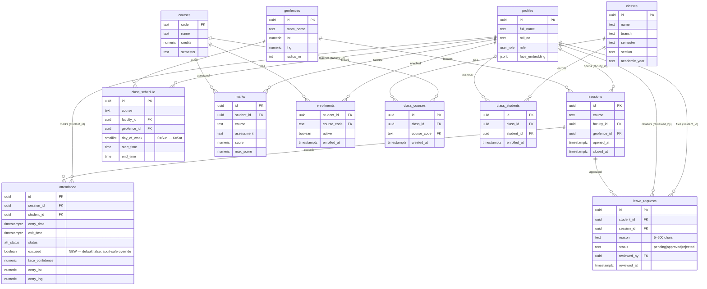

# Entity-Relationship Diagram

Logical model after migrations **0010** (timetable) and **0011** (leave/appeals).
Rendered as Mermaid so it stays in-repo and diffable.

## Relationships of note

1. **`class_schedule`** is independent of `sessions`. Opening a class from a
   timetable card calls the existing `openSession()` with pre-filled
   `course` + `geofence_id` — it does **not** FK-link schedule → session.
2. **`leave_requests`** is unique on `(student_id, session_id)` so a student
   files at most one appeal per session.
3. **`attendance.excused`** never rewrites `status`, `entry_time`, or GPS
   fields. The `attendance_summary` view excludes excused rows from both
   numerator and denominator.

## Known limitations

| Limitation | Why deferred |
|------------|--------------|
| No room double-booking constraint on `class_schedule` (same geofence, same day, overlapping times) | Scope: timetable MVP first; add an exclusion constraint or trigger later if needed |
| Faculty RLS allows faculty to write their own schedule rows, but app actions are **admin-only** for upsert/delete | Belt-and-suspenders; admin owns the institution timetable in the UI |
| Rejected appeals cannot be re-filed (unique constraint) | Prevents spam; staff can be asked to delete the row if a re-file is legitimate |
